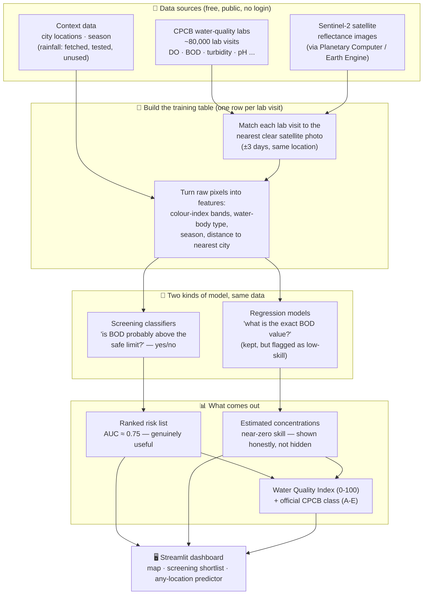

# Aqua-Sense

**Water quality of Indian inland waters from CPCB measurements and Sentinel-2 imagery**

Measured DO, BOD and turbidity (CPCB National Water Quality Monitoring, ~3,100 surface-water stations) are matched to
Sentinel-2 L2A reflectance and validated with site-blocked spatial cross-validation against "predict the average"
baselines. A satellite-adapted WQI (0-100) and the official CPCB designated-best-use class (A-E) are computed from
measured or predicted parameters.

**Headline result: pollution screening, not exact concentrations.** DO and BOD are not optically active — reflectance
cannot see dissolved oxygen or sewage loading directly, and a variance decomposition confirms 85-100% of each
target's variance is between-station (set by local discharge, invisible from space), not something one satellite
visit can resolve. Exact-value regression on those targets is near-zero skill (honestly reported, not hidden) and is
kept only as a secondary, flagged result. What the same data *can* do well is a binary pollution screen — "is this
station's water likely polluted, for an inspector to prioritise" — out-of-fold **AUC ≈ 0.72-0.78** across BOD>3 mg/L
(CPCB Class C limit), BOD>6 mg/L, DO<4 mg/L and CPCB-class screens. See `AQUA_SENSE_PROJECT_PLAN.md` §11 and
`reports/real/screening_metrics.json` for the full evidence.

**Real-number regression, close to an existing station.** A second result, added later and reported separately: a
distance-weighted spatial-KNN model (`src/models/spatial_baseline.py`) combining nearby *other* CPCB stations' known
values with the satellite/context features raises out-of-fold regression skill substantially — DO R² 0.02 → **0.40**,
BOD R²(log) 0.17 → **0.46**, turbidity R²(log) 0.04 → **0.44** — but **only near an already-monitored station**
(skill fades from Spearman 0.70 at <5 km to 0.42 at 50-200 km). This is a genuinely different, easier question than
"work anywhere in India" and is never blended with the numbers above. See `AQUA_SENSE_PROJECT_PLAN.md` §12 and
`reports/real/spatial_knn_summary.json`.

## In plain terms

Government inspectors physically visit rivers and lakes, dip a bottle in the water, and send it to a lab to
measure things like dissolved oxygen and sewage content (BOD). That's accurate, but it only covers ~3,100 spots
in India and each spot gets checked a few times a year at most — most of the country's water is never checked.

Satellites photograph the same water bodies every few days, for free, everywhere. The question this project asks
is: **can a satellite photo tell us which water is polluted, without a physical visit?**

The honest answer turned out to be nuanced, and the project is built around that honesty rather than around a
sales pitch:
- **"Give me the exact number" (e.g. "BOD is 4.2 mg/L") — mostly no.** Sewage and dissolved oxygen don't change
  the colour of water in a way a camera can reliably pick up; the water's *history* (what's upstream, whose
  sewage drains in) matters far more than what it looks like on one day.
- **"Tell me if this spot is probably polluted, so I know where to send an inspector first" — yes, usefully.**
  That's a coarser, easier question, and the satellite answers it right about 3 times out of 4 (AUC ≈ 0.75) —
  good enough to turn "check 3,100 random spots" into "check these 500 first."

So Aqua-Sense's real deliverable is a **triage tool**: a ranked list of which water bodies most likely need a
human to go check, built entirely from free satellite images plus government lab data used to teach the model
what "polluted" looks like from space. It does not replace lab testing — it tells you where to point it.

## How it works (system architecture)



**Why it's built this way, step by step:**

1. **Match, don't assume.** A lab visit and a satellite photo are only paired up if they're within 3 days of
   each other at the same spot — no interpolation, no guessing what the water looked like.
2. **Features, not raw pixels.** Rather than feeding raw colour bands straight into a model, the pipeline
   computes indices known to relate to water quality (e.g. NDCI, red/green ratio), plus non-satellite context
   (season, water-body type, distance to the nearest city as a proxy for sewage/industrial load) — but *only*
   for the targets where that context measurably helps (see `src/models/schema.py::FEATURE_SETS`).
3. **Two models per question, honestly scored.** Every model is validated with *site-blocked* cross-validation
   — it's never tested on a water body it already saw during training — and every score is compared against a
   "just predict the average" baseline on the same split, so a model can't look good by accident.
4. **The dashboard shows both, labelled.** The screening shortlist is front-and-centre; the exact-concentration
   numbers are still shown (useful as a rough signal, and DO/BOD/turbidity have real physical meaning), but
   carry an explicit "no demonstrated skill" flag where that's true rather than a falsely confident number.

## Team
- **Aadi (P1)** — Geospatial / Data Engineer
- **Marutey (P2)** — Data Scientist
- **Navya (P3)** — ML Engineer A
- **Jashan (P4)** — ML Engineer B / Full-Stack

## Setup

```bash
python -m venv .venv && .venv\Scripts\activate      # Windows; use source .venv/bin/activate elsewhere
pip install -r requirements.txt
```

No logins are needed for the real-data pipeline (CPCB NWDP and Planetary Computer are open).
Optional: Kaggle (`~/.kaggle/access_token`) and Google Earth Engine (step-by-step in `docs/EARTH_ENGINE_SETUP.md`).
**Never commit credentials** (`.gitignore` blocks common token file names).

## Real-data pipeline

```bash
python -m scripts.fetch_insitu                      # 1. download CPCB surface-water CSVs -> data/ground_truth/insitu_master.parquet
python -m scripts.extract_satellite --per-state 100 # 2. Sentinel-2 reflectance at station-visits (resumable, ~1 s/visit)
python -m scripts.build_real_training_table         # 3. join -> data/processed/train_real.parquet + reports/real/dataset_summary.json
python -m scripts.validate_empirical_formulas       # 4. test literature formulas against the real measurements
python -m scripts.validate_landsat_temperature      #    (optional, needs a Kaggle token) Landsat temperature vs in-situ IoT sensors
python -m scripts.train_real_models --trials 30     # 5. secondary: DO/BOD/turbidity regression, out-of-fold, SHAP -> reports/real/
python -m scripts.train_screening                   # 6. headline: pollution-screening classifiers -> reports/real/screening_metrics.json
python -m scripts.train_spatial_baseline            # 7. real-number regression near an existing station -> reports/real/spatial_knn_summary.json
streamlit run src/app/streamlit_app.py              # dashboard (real-data mode when train_real.parquet exists; see the Screening tab)
```

What the real data does and does not contain (details in `data/ground_truth/data_source_log.md`):
DO, BOD, pH, coliform, conductivity and turbidity are measured; **chlorophyll-a and water temperature are not**.
Chl-a values in the repo are formula estimates (`chl_a_empirical`) and are not validated. Season and urban-proximity
context (`src/models/schema.py::FEATURE_SETS`) feed the BOD models; antecedent rainfall was fetched and validated
(`src/data/weather.py`) but tested out of every model — it stays in the parquet as unused data.

## Flow State UI (React + FastAPI)

`frontend/` is the Flow State web UI (React 19, Vite, Tailwind 4, Leaflet). `src/api/` is the JSON API it reads; it serves
the artifacts the pipeline above already produced (`train_real_large.parquet`, `screening_shortlist.csv`,
`screening_metrics.json`), so run steps 1-5 first.

```bash
cd frontend && npm install && npm run build && cd ..   # once
uvicorn src.api.server:app --port 8000                 # UI + API at http://localhost:8000
# development with hot reload: uvicorn on :8000, then `npm run dev` in frontend/ -> http://localhost:5173
```

Endpoints: `/api/overview /stations /stations/{id} /compare /search /cities /priorities /recommendations /alerts /scene`
and `POST /api/ask` (a deterministic keyword-to-filter parser, not an LLM).
Map risk = the screening model's breach probability (high >= 50 %, moderate >= 25 %); the time slider switches to measured
per-year WQI bands. The design's sewage-outlet / STP / drainage / land-use / forecast layers have no data source in this
repo, so they are shown as "soon" rather than faked.

## Other commands

```bash
python -m pytest tests/ -v                          # all tests
python scripts/generate_synthetic_train.py          # synthetic DEMO data only (used when no real table exists)
python scripts/train_models.py --trials 10          # models on the synthetic table
```

See `AQUA_SENSE_PROJECT_PLAN.md` for the plan and `FIX_PLAN.md` for the review checklist.
