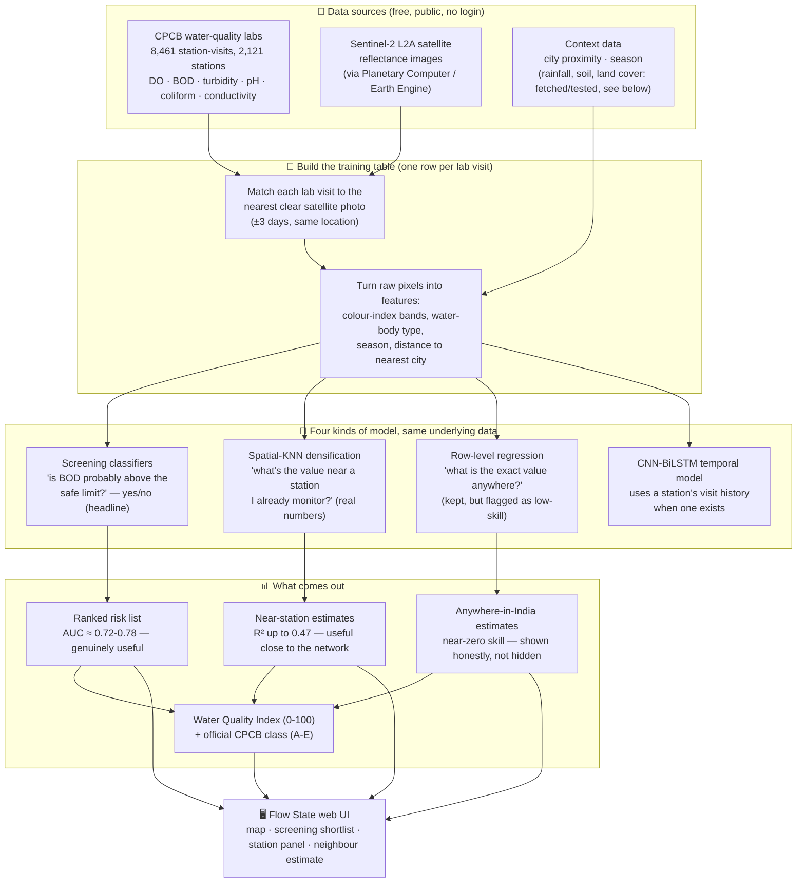

# Flow State

*Water quality of Indian inland waters from CPCB measurements and Sentinel-2 imagery.*

**Live demo:** [flowstate-seven-olive.vercel.app](https://flowstate-seven-olive.vercel.app) (frontend, Vercel) ·
API at `flowstate-api-fgfo.onrender.com` (Render free tier — the first request after idle can take ~30-60s to wake
the instance).

Measured DO, BOD and turbidity (CPCB National Water Quality Monitoring, ~2,100 surface-water stations, 8,461
station-visits) are matched to Sentinel-2 L2A reflectance and validated with site-blocked spatial cross-validation
against "predict the average" baselines. A satellite-adapted WQI (0-100) and the official CPCB designated-best-use
class (A-E) are computed from measured or predicted parameters.

## Table of contents

- [Headline results](#headline-results)
- [In plain terms](#in-plain-terms)
- [How it works (system architecture)](#how-it-works-system-architecture)
- [Data sources](#data-sources)
  - [CPCB National Water Quality Monitoring (ground truth)](#cpcb-national-water-quality-monitoring-ground-truth)
  - [Sentinel-2 L2A reflectance](#sentinel-2-l2a-reflectance)
  - [Context features (non-satellite)](#context-features-non-satellite)
  - [Monitoring sites (`config/sites.yaml`)](#monitoring-sites-configsitesyaml)
  - [Optional data sources](#optional-data-sources)
- [Repository layout](#repository-layout)
- [Feature schema (`src/models/schema.py`)](#feature-schema-srcmodelsschemapy)
- [Water Quality Index engine (`src/wqi/wqi_engine.py`)](#water-quality-index-engine-srcwqiwqi_enginepy)
  - [Satellite-adapted WQI (0-100)](#satellite-adapted-wqi-0-100)
  - [CPCB designated-best-use class (A-E)](#cpcb-designated-best-use-class-a-e)
- [Models](#models)
  - [1. Pollution-screening classifiers (headline result)](#1-pollution-screening-classifiers-headline-result)
  - [2. Row-level concentration regression (secondary, low-skill, disclosed)](#2-row-level-concentration-regression-secondary-low-skill-disclosed)
  - [3. Spatial-KNN densification model (real-number regression near a station)](#3-spatial-knn-densification-model-real-number-regression-near-a-station)
  - [4. Deep-learning temporal model](#4-deep-learning-temporal-model)
  - [5. WQI-tier classifier](#5-wqi-tier-classifier)
- [Evaluation methodology](#evaluation-methodology)
- [Negative and rejected results (kept, not hidden)](#negative-and-rejected-results-kept-not-hidden)
- [Metrics reference (every number, one table)](#metrics-reference-every-number-one-table)
- [Atmospheric correction (ACOLITE / C2RCC)](#atmospheric-correction-acolite--c2rcc)
- [Team](#team)
- [Setup](#setup)
- [Real-data pipeline](#real-data-pipeline)
- [Flow State UI (React + FastAPI)](#flow-state-ui-react--fastapi)
  - [Frontend (`frontend/`)](#frontend-frontend)
  - [API (`src/api/`)](#api-srcapi)
  - [Deployment (Vercel + Render)](#deployment-vercel--render)
- [Configuration reference](#configuration-reference)
- [Testing and CI](#testing-and-ci)
- [Known limitations and open items](#known-limitations-and-open-items)
- [Other commands](#other-commands)
- [Further reading](#further-reading)

## Headline results

**Pollution screening, not exact concentrations.** DO and BOD are not optically active — reflectance cannot see
dissolved oxygen or sewage loading directly, and a variance decomposition confirms 85-100% of each target's variance
is between-station (set by local discharge, invisible from space), not something one satellite visit can resolve.
Exact-value regression on those targets is near-zero skill (honestly reported, not hidden) and is kept only as a
secondary, flagged result. What the same data *can* do well is a binary pollution screen — "is this station's water
likely polluted, for an inspector to prioritise" — out-of-fold on `train_real_large.parquet` (8,460 rows / 2,121
stations, 5-fold site-blocked spatial CV):

| Screen | n | base rate | **AUC** | avg. precision | lift vs. base rate | precision @ top 10% |
| --- | --- | --- | --- | --- | --- | --- |
| BOD > 3 mg/L (CPCB Class C limit) | 6,833 | 28.8% | **0.756** | 0.600 | 2.08× | 75.8% |
| BOD > 6 mg/L | 6,833 | 13.0% | **0.780** | 0.443 | 3.40× | 51.4% |
| DO < 4 mg/L | 8,151 | 7.3% | **0.726** | 0.169 | 2.33× | — |
| CPCB class below "acceptable" (`cpcb_polluted`) | 8,416 | 28.6% | **0.736** | 0.587 | 2.05× | — |

See `AQUA_SENSE_PROJECT_PLAN.md` §11 and `reports/real/screening_metrics.json` for the full evidence, including
calibration curves.

**Real-number regression, close to an existing station.** A second result, added later and reported separately: a
distance-weighted spatial-KNN model (`src/models/spatial_baseline.py`) combining nearby *other* CPCB stations' known
values with the satellite/context features raises out-of-fold regression skill substantially over a plain XGBoost
regressor — but **only near an already-monitored station**:

| target | rows | stations | KNN-alone R² | KNN-alone Spearman | **KNN + XGBoost R²** | KNN + XGBoost R²(log) | Spearman @ <5 km | Spearman @ 50-200 km |
| --- | --- | --- | --- | --- | --- | --- | --- | --- |
| DO | 8,151 | 2,012 | 0.385 | 0.648 | **0.417** | n/a (not log-modelled) | 0.680 | 0.698 |
| BOD | 6,833 | 1,956 | −0.037 | 0.652 | 0.087 | **0.475** | 0.704 | 0.424 |
| turbidity | 3,223 | 1,450 | 0.028 | 0.613 | 0.107 | **0.469** | 0.682 | 0.478 |

This is a genuinely different, easier question than "work anywhere in India" and is never blended with the screening
numbers above. Full distance-decile breakdown, sensitivity checks, the land-cover ablation, and the k/eps_km sweep are
in `AQUA_SENSE_PROJECT_PLAN.md` §12 and `reports/real/spatial_knn_summary.json`.

## In plain terms

Government inspectors physically visit rivers and lakes, dip a bottle in the water, and send it to a lab to
measure things like dissolved oxygen and sewage content (BOD). That's accurate, but it only covers ~2,100 spots
in India and each spot gets checked a few times a year at most — most of the country's water is never checked.

Satellites photograph the same water bodies every few days, for free, everywhere. The question this project asks
is: **can a satellite photo tell us which water is polluted, without a physical visit?**

The honest answer turned out to be nuanced, and the project is built around that honesty rather than around a
sales pitch:
- **"Give me the exact number" (e.g. "BOD is 4.2 mg/L") — mostly no, unless there's already a monitored station
  nearby.** Sewage and dissolved oxygen don't change the colour of water in a way a camera can reliably pick up; the
  water's *history* (what's upstream, whose sewage drains in) matters far more than what it looks like on one day.
- **"Tell me if this spot is probably polluted, so I know where to send an inspector first" — yes, usefully.**
  That's a coarser, easier question, and the satellite answers it right about 3 times out of 4 (AUC ≈ 0.75-0.78) —
  good enough to turn "check 2,100 random spots" into "check these first."
- **"Give me a number near a spot that's already monitored" — yes, meaningfully better than guessing the average.**
  A distance-weighted blend of nearby stations' known values plus the satellite/context features gets real R² gains
  (DO 0.02 → 0.42) within tens of kilometres of the existing network, tapering off with distance.

So Flow State's real deliverable is a **triage tool**: a ranked list of which water bodies most likely need a
human to go check, built entirely from free satellite images plus government lab data used to teach the model
what "polluted" looks like from space. It does not replace lab testing — it tells you where to point it.

## How it works (system architecture)



**Why it's built this way, step by step:**

1. **Match, don't assume.** A lab visit and a satellite photo are only paired up if they're within 3 days of
   each other at the same spot — no interpolation, no guessing what the water looked like.
2. **Features, not raw pixels.** Rather than feeding raw colour bands straight into a model, the pipeline
   computes indices known to relate to water quality (e.g. NDCI, red/green ratio), plus non-satellite context
   (season, water-body type, distance to the nearest city as a proxy for sewage/industrial load) — but *only*
   for the targets where that context measurably helps (see [Feature schema](#feature-schema-srcmodelsschemapy)).
3. **Four models, each answering a different question, all honestly scored.** Every model is validated with
   *site-blocked* cross-validation — it's never tested on a water body it already saw during training — and every
   score is compared against a "just predict the average" baseline on the same split, so a model can't look good by
   accident.
4. **The UI shows all of it, labelled.** The screening shortlist is front-and-centre; the neighbour estimate and
   exact-concentration numbers are still shown (useful as a rough signal, and DO/BOD/turbidity have real physical
   meaning), but carry an explicit skill/confidence label rather than a falsely confident number.

## Data sources

### CPCB National Water Quality Monitoring (ground truth)

Fetched by `scripts/fetch_insitu.py` / `src/data/nwdp.py` from CPCB's open National Water Data Portal (NWDP) API —
no login needed. Produces `data/ground_truth/insitu_master.parquet`.

- **Coverage:** 2,121 stations, 35 states/UTs, date range 2019-01-01 to 2021-12-30, 8,461 station-visits after
  matching to a usable satellite scene.
- **Parameters measured:** dissolved oxygen (DO), biochemical oxygen demand (BOD), pH, total coliform, electrical
  conductivity, and turbidity. Labels available per parameter (after satellite matching): DO 8,152, BOD 6,834,
  turbidity 3,223.
- **Not measured, anywhere in the dataset:** chlorophyll-a and water temperature. Any `chl_a` value in the repo
  (`chl_a_empirical`) is a formula estimate, not a lab measurement, and is unvalidated. Water temperature (`temp_c`
  / `temperature` / `temp_surface`) defaults to 25°C in the WQI engine when absent (see
  [Satellite-adapted WQI](#satellite-adapted-wqi-0-100)).
- **Water-body type breakdown:** river 4,288, unknown 2,158, lake 1,426, reservoir 589.
- **Full provenance, caveats and what was cross-checked** (e.g. Planetary Computer vs. Earth Engine agreement) is in
  `data/ground_truth/data_source_log.md`.

### Sentinel-2 L2A reflectance

Extracted by `scripts/extract_satellite.py` / `src/data/satellite_extract.py`, sourced from Microsoft's Planetary
Computer STAC catalog (open, no login; `pystac-client` + `planetary-computer`), resumable at roughly 1 second per
station-visit. Matching allows up to a 3-day gap between the lab visit and the satellite scene
(`day_diff_days` distribution: 0 days for 1,619 visits, 1 day for 3,236, 2 days for 2,595, 3 days for 1,011).

Extraction is not always successful — `dataset_summary_large.json`'s `extraction_status_counts` records every
attempt: 9,038 ok, 4,265 with no usable scene in the window, 3,149 rejected for cloud cover, 2,464 rejected for
having no water pixels in the AOI (below `min_water_px: 20`).

**Bands and derived spectral features** (12 columns, `SPECTRAL_COLS` in `src/models/schema.py`):

| Column | Meaning |
| --- | --- |
| `B2`, `B3`, `B4`, `B5`, `B6`, `B8`, `B11` | Sentinel-2 L2A surface reflectance: blue, green, red, red-edge 1, red-edge 2, NIR, SWIR1 |
| `ndci` | Normalized Difference Chlorophyll Index, `(B5-B4)/(B5+B4)` |
| `bdm2`, `bdm3` | Blue/green and blue/red band-difference/ratio turbidity proxies |
| `red_green` | Red/green ratio |
| `nir` | Alias/derived NIR-based feature used alongside raw `B8` |

Water pixels are isolated per site with an MNDWI threshold (see
[Configuration reference](#configuration-reference)) before any band statistics are computed
(`src/preprocessing/masking.py`), tuned per site by `scripts/tune_mndwi.py`.

### Context features (non-satellite)

Sewage and dissolved-oxygen loading are physical processes reflectance cannot see directly. Four non-satellite
signal families were fetched and tested; only two are wired into the shipped feature sets, and the schema module
documents exactly why for each (see [Feature schema](#feature-schema-srcmodelsschemapy)):

| Source | Module | Status |
| --- | --- | --- |
| Water-body type (river/lake/reservoir) | CPCB metadata, `add_water_body_onehot` in `schema.py` | **Used** — turbidity and BOD feature sets |
| Season (winter/summer/monsoon) | `date` column, `add_season_onehot` in `schema.py` | **Used** — BOD feature set only |
| Urban/industrial proximity | `src/data/city_proximity.py` — haversine distance to ~85 major Indian city centroids + a population-weighted `urban_load_index` | **Used** — BOD feature set only (+0.121 R² in clean ablation) |
| Antecedent rainfall | `src/data/weather.py` — Open-Meteo Historical Weather API (ERA5/ERA5-Land reanalysis), 3/7/14/30-day totals | **Fetched, validated, NOT used** — never beat urban proximity alone and added nothing on top of it in clean ablations; kept in the parquet as unused data (`RAINFALL_COLS`) |
| Soil composition | `src/data/soil.py` — ISRIC SoilGrids v2.0 REST API (organic carbon %, clay %, pH, bulk density) | **Not run** — this sandbox has no network route to `rest.isric.org` (confirmed via direct connectivity tests); fetch/feature code is written and unit-tested against mocked responses only |
| Land-cover composition | `src/data/land_cover.py` — ESA WorldCover 10m via Planetary Computer STAC | **Run and rejected** — backfilled for real, but the ablation gain was below the +0.02 R² bar this codebase holds every context feature to (see [Negative and rejected results](#negative-and-rejected-results-kept-not-hidden)) |

### Monitoring sites (`config/sites.yaml`)

13 named sites used for site-level tooling (MNDWI tuning, raster preview, per-site extraction), spanning 6
states/UTs. Each entry has a name, water-body type, state, bounding box, and approximate surface elevation
(altitude lowers the DO-saturation ideal value used by the WQI engine):

| Site | Type | State | Altitude (m) |
| --- | --- | --- | --- |
| `bellandur`, `varthur`, `ulsoor` | lake | Karnataka | 890, 880, 900 |
| `sutlej_ludhiana`, `beas_amritsar`, `ghaggar_patiala`, `buddha_nullah_ludhiana` | river | Punjab | 245, 235, 250, 245 |
| `yamuna_delhi` | river | Delhi | 215 |
| `ganga_kanpur`, `ganga_varanasi` | river | Uttar Pradesh | 125, 80 |
| `hussain_sagar` | lake | Telangana | 505 |
| `dal_lake` | lake | Jammu and Kashmir | 1,583 |
| `chilika` | lagoon | Odisha | 0 |

The full-India screening/regression training tables are not limited to these 13 sites — they cover all 2,121 CPCB
stations across 35 states; `sites.yaml` is used by the satellite-side tooling that needs an explicit bounding box
per named water body.

### Optional data sources

- **Kaggle datasets** (`src/data/kaggle_sources.py`, needs a token in `~/.kaggle/access_token` or
  `KAGGLE_API_TOKEN`): Ganga and Sangam river IoT sensor data, used only to validate Landsat-derived surface
  temperature (`scripts/validate_landsat_temperature.py`) — pH/conductivity from these sources were found
  unreliable and are not used as training labels. A third dataset (`anbarivan`, 2003-2014) predates Sentinel-2 and
  cannot be matched to any scene.
- **Google Earth Engine** (`src/acquisition/gee.py`, `src/data/gee_extract.py`): an alternative Sentinel-2 access
  path, used to cross-check Planetary Computer extractions and for MNDWI threshold tuning; step-by-step setup in
  `docs/EARTH_ENGINE_SETUP.md`.

## Repository layout

```
config/                     Site definitions and per-site MNDWI thresholds (see Configuration reference)
data/
  ground_truth/              CPCB in-situ parquet + data_source_log.md (full provenance)
  raw/l1c/                    Downloaded raw Sentinel-2 L1C scenes (ACOLITE dry run)
  interim/c2rcc/               Intermediate rasters for the (untested) C2RCC path
  processed/                  train_real.parquet, train_real_large.parquet, train.parquet (synthetic demo)
docs/
  EARTH_ENGINE_SETUP.md        Step-by-step Earth Engine auth/setup
frontend/                    React 19 + Vite + Tailwind 4 + Leaflet UI ("Flow State")
  src/flow/                   Landing.tsx, Map.tsx, Workspace.tsx, api.ts, data.ts, theme.ts, ui.tsx
reports/real/                Every metric, ablation, SHAP plot and trained-model artifact this README cites
scripts/                     One entry point per pipeline stage (see Real-data pipeline and Other commands)
src/
  acquisition/                 Earth Engine site/export helpers
  api/                          FastAPI server (server.py) + the Store/query layer (service.py)
  data/                         Fetchers and feature builders: nwdp, satellite_extract, weather, city_proximity,
                                 soil, land_cover, landsat_temp, insitu, training_table, sensors, aoi, kaggle_sources
  features/                     spatial_temporal_join.py (visit-to-scene matching), feature_engineering.py
  models/                       schema.py (feature/target source of truth), xgboost_pipeline.py, spatial_baseline.py,
                                 spatial_cv.py, dl_model.py + dl_training.py, tier_classifier.py, shap_explainer.py,
                                 baselines.py, comparison.py, metrics.py
  preprocessing/                masking.py (MNDWI water mask), correction.py + correction_convert.py (ACOLITE/C2RCC),
                                 predict_raster.py
  wqi/                          wqi_engine.py (WQI + CPCB class), water_chemistry.py (DO saturation, free ammonia)
tests/                        303 test functions across 30 files, one per src module (see Testing and CI)
AQUA_SENSE_PROJECT_PLAN.md   The full narrative plan/evidence log (15 sections, referenced throughout this README)
FIX_PLAN.md                  Review checklist + submission-status table
```

## Feature schema (`src/models/schema.py`)

This module is the single source of truth for which columns feed which model — everything downstream imports from
it rather than hardcoding column lists. Its central finding: **feature sets are per-target, not global.** A single
shared feature list was replaced after clean ablations (identical rows, identical spatial-CV folds, same random
seed) on `train_real_large.parquet`:

| target | rows | best feature set | Spearman (best) | effect of context features |
| --- | --- | --- | --- | --- |
| `bod` | 4,684 | spectral + type + season + urban | 0.256 → 0.350 (+urban) | urban proximity **+0.121 R²**; rainfall +0.122 R² too, but adds nothing on top of urban and is dropped |
| `do` | 5,571 | spectral only | best at spectral-only | +urban R² **−0.074**, +rainfall R² **−0.079** — context features actively hurt DO |
| `turbidity` | 2,308 | spectral + type | best at spectral-only/+type | +urban R² **−0.111**, +rainfall R² **−0.158** — same story |

Reasoning: **DO is not optically active at all**, so non-satellite context just adds noise. **Turbidity** gains from
knowing water-body type because rivers show a materially steeper reflectance-turbidity relationship than still
water (`reports/real/empirical_formula_validation.json`). **BOD** is the one target where urban proximity is a real,
measured gain — sewage/industrial discharge concentrates near cities in a way reflectance can't see but distance-to-city
can proxy for.

```python
FEATURE_SETS = {
    "do":        SPECTRAL_COLS,                                                    # 12 columns
    "turbidity": SPECTRAL_COLS + TYPE_COLS,                                        # 15 columns
    "bod":       SPECTRAL_COLS + TYPE_COLS + SEASON_COLS + URBAN_PROXY_COLS,        # 20 columns
}
```

Column families:
- `SPECTRAL_COLS` (12): `B2 B3 B4 B5 B6 B8 B11 ndci bdm2 bdm3 red_green nir`
- `TYPE_COLS` (3): `is_river is_lake is_reservoir` — one-hot of `water_body_type`; all-zero = `unknown` baseline
- `SEASON_COLS` (3): `is_winter is_summer is_monsoon` — from the visit month; all-zero = post-monsoon (Oct-Nov) baseline
- `URBAN_PROXY_COLS` (2): `dist_nearest_city_km urban_load_index`
- `RAINFALL_COLS` (4, unused): `rain_3d_mm rain_7d_mm rain_14d_mm rain_30d_mm`
- `SOIL_COLS` (4, unused — never fetched): `soil_organic_carbon_pct soil_clay_pct soil_ph soil_bulk_density_gcm3`
- `LAND_COVER_COLS` (3, fetched + ablated, not adopted): `landcover_cropland_pct landcover_built_pct landcover_tree_pct`

Other schema constants: `LOG_TARGETS = ("bod", "turbidity", "chl_a")` — heavy-tailed targets modelled on a log1p
scale; `REAL_TARGET_COLS = ("do", "bod", "turbidity")` — Chl-a has no ground truth so is never a real training
target; `META_COLS = (site, water_body_type, lat, lon, date, sensor)`. The synthetic demo table
(`SYNTH_FEATURE_COLS`, `SYNTH_TARGET_COLS`) is a separate, smaller schema used only when no real table exists (see
[Other commands](#other-commands)).

## Water Quality Index engine (`src/wqi/wqi_engine.py`)

Two independent outputs, deliberately kept separate — one is Flow State's own scoring convention, the other is the
government's own legal classification:

### Satellite-adapted WQI (0-100)

A Brown-type weighted-arithmetic pollution index, 0 = pristine, 100 = worst. **This is Flow State's own convention,
not an official CPCB product.**

```
Qi  = 100 * (Vi - V0) / (Si - V0)     clipped to [0, 100]        (pH: Qi = 100 * |Vi - 7| / (Si - 7))
Wi  = K / Si,   K = 1 / sum(1/Si)     weights renormalised over the parameters actually present
WQI = sum(Wi * Qi)
```

Only parameters that are present (not NaN) contribute — nothing is imputed — and a score is only computed when at
least `min_params` (default 2) parameters are available. One deliberate deviation from the textbook formula: the
ideal DO value `V0` is the **saturation concentration at the measured water temperature** (default 25°C, adjusted
for site altitude via `do_saturation_mg_l` in `src/wqi/water_chemistry.py`) instead of the textbook 14.6 mg/L
(saturation at 0°C), which no Indian surface water can reach.

| Parameter | Unit | Ideal (V0) | Standard (Si) | Basis |
| --- | --- | --- | --- | --- |
| Dissolved oxygen | mg/L | temperature-adjusted saturation | 5.0 | CPCB Class B minimum |
| BOD | mg/L | 0.0 | 3.0 | CPCB Class B/C maximum |
| pH (two-sided) | – | 7.0 | 8.5 | CPCB Class A/B upper limit |
| Turbidity | NTU | 0.0 | 5.0 | IS 10500 permissible limit |
| Chlorophyll-a | µg/L | 0.0 | 10.0 | eutrophication reference value, **not a CPCB standard** |
| Total coliform | MPN/100 mL | 0.0 | 500.0 | CPCB Class B maximum |
| Electrical conductivity | µS/cm | 0.0 | 2,250.0 | CPCB Class E maximum |

**WQI tiers** (single definition used everywhere in the repo, `WQI_TIERS`):

| Tier | Range | Colour |
| --- | --- | --- |
| Excellent | 0–20 | `#2166ac` |
| Good | 20–40 | `#4dac26` |
| Moderate | 40–60 | `#f7c000` |
| Poor | 60–80 | `#f46d43` |
| Very Poor | 80–100 | `#d73027` |

Observed distribution across the full real dataset (`dataset_summary_large.json`): Moderate 2,511, Poor 2,397, Good
1,618, Very Poor 1,558, Excellent 356 (21 rows had too few parameters to score).

### CPCB designated-best-use class (A-E)

Computed from the concentration criteria CPCB actually publishes
([cpcb.gov.in/water-quality-criteria](https://cpcb.gov.in/water-quality-criteria/)), independently of the WQI score
above — a sample gets the best class (A first) for which every *available* criterion is met and at least
`min_criteria` (default 2) criteria could be evaluated:

| Class | Designated best use | Key criteria checked |
| --- | --- | --- |
| A | Drinking water source without conventional treatment, after disinfection | coliform ≤ 50, pH 6.5-8.5, DO ≥ 6.0, BOD ≤ 2.0 |
| B | Outdoor bathing (organised) | coliform ≤ 500, pH 6.5-8.5, DO ≥ 5.0, BOD ≤ 3.0 |
| C | Drinking water source after conventional treatment + disinfection | coliform ≤ 5,000, pH 6.0-9.0, DO ≥ 4.0, BOD ≤ 3.0 |
| D | Propagation of wildlife and fisheries | pH 6.5-8.5, DO ≥ 4.0, free ammonia ≤ 1.2 |
| E | Irrigation, industrial cooling, controlled waste disposal | pH 6.0-8.5, conductivity ≤ 2,250, SAR ≤ 26, boron ≤ 2.0 |
| Below E | none of the above satisfied | — |

`free_ammonia` is derived from total ammonia-N, pH and temperature when only total ammonia-N is measured
(`water_chemistry.free_ammonia_n`). Observed class distribution: A 2,818, B 2,204, D 1,466, C 988, Below E 571, E
370 (44 rows unclassifiable).

## Models

Four models answer four different questions from the same underlying data — they are never blended into a single
number, and each carries its own honestly-reported skill.

### 1. Pollution-screening classifiers (headline result)

`scripts/train_screening.py` — gradient-boosted binary classifiers (XGBoost) predicting whether a station-visit
crosses a regulatory threshold, using the full 20-column BOD feature set (spectral + type + season + urban
proximity) regardless of target, since screening pools information across all three chemistry axes. Out-of-fold via
5-fold site-blocked spatial CV. See [Headline results](#headline-results) for the full metrics table
(`reports/real/screening_metrics.json`), including calibration curves per decile.

### 2. Row-level concentration regression (secondary, low-skill, disclosed)

`scripts/train_real_models.py` — per-target XGBoost regressors (`src/models/xgboost_pipeline.py`,
Optuna-tuned, 30 trials by default) using each target's own `FEATURE_SETS` entry, log1p-transformed for
`LOG_TARGETS`. Out-of-fold, 5-fold site-blocked spatial CV, broken down by water-body type
(`reports/real/metrics_summary.json`, `metrics_table.csv`):

| target | water body | n | R² | R²(log) | Spearman |
| --- | --- | --- | --- | --- | --- |
| bod | overall | 6,833 | 0.011 | 0.171 | 0.403 |
| bod | lake | 1,322 | 0.064 | 0.246 | 0.456 |
| bod | river | 3,331 | 0.024 | 0.180 | 0.337 |
| bod | reservoir | 450 | −0.015 | 0.063 | 0.313 |
| do | overall | 8,151 | 0.021 | n/a | 0.160 |
| do | lake | 1,346 | −0.025 | n/a | 0.163 |
| do | reservoir | 583 | 0.063 | n/a | — |

Best-trial CV RMSE from the Optuna search: DO 1.84, BOD 0.62 (log scale), turbidity 1.20 (log scale). This is
reported as a **secondary result and flagged as near-zero skill anywhere far from a monitored station** — the
screening classifiers above are the deliverable this project actually recommends acting on for new locations.

### 3. Spatial-KNN densification model (real-number regression near a station)

`src/models/spatial_baseline.py` (`SpatialKNNRegressor`), trained by `scripts/train_spatial_baseline.py`. The CPCB
network of ~2,100 stations stays fixed; this model estimates DO/BOD/turbidity at a nearby *unmonitored* point by
combining:
1. A distance-weighted k-nearest-station baseline (`knn_predict`, default `k=5`, `eps_km=0.1` inverse-distance
   smoothing) over the other stations' known values.
2. The target's own satellite/context features (from `FEATURE_SETS`).
3. Two confidence-signal features fed into the inner model itself: `nearest_station_km` (distance to the closest
   reference station) and `knn_neighbor_std` (spread across the k neighbours actually used) — so the inner
   Optuna-tuned XGBoost can learn to trust the KNN baseline less when the nearest station is far away or the local
   neighbourhood is heterogeneous.

Evaluated with `StationKFold` (20 folds; see [Evaluation methodology](#evaluation-methodology) for why this differs
from the row-level model's `SpatialKFold`). Full results including the distance-decile Spearman breakdown are in
[Headline results](#headline-results) and `reports/real/spatial_knn_summary.json`. `k`/`eps_km` were swept per
target (`scripts/sweep_spatial_knn.py`, grid `k ∈ {3,5,8,12} × eps_km ∈ {0.05,0.1,0.5,1.0}`, results in
`reports/real/spatial_knn_sweep.json`); land-cover features and sample-weighting by `n_water_px` were both re-tested
specifically on this model (not just the row-level one) and are recorded in
`spatial_knn_summary.json["n_water_px_ablation"]` and `reports/real/land_cover_ablation.json`.

A station's panel in the UI shows this model's held-out estimate next to the measured value
(`scripts/export_spatial_knn_oof.py` → `reports/real/spatial_knn_oof.parquet`), reproducing the headline scores to
within about 0.01 (DO R² 0.418, BOD R²(log) 0.467, turbidity R²(log) 0.467 in the exported OOF frame — Optuna is not
bit-for-bit repeatable run to run).

### 4. Deep-learning temporal model

`src/models/dl_model.py` + `dl_training.py`, trained by `scripts/train_dl_real.py` — a CNN-BiLSTM with masked
attention over each station's visit-history window (window size 3, max gap 90 days between visits to count as
"history"). Only 41.5% of samples (mean window length 1.64) actually have prior-visit history to exploit
(`reports/real/dl_summary.json`), which caps how much this model can help versus the row-level regressor above; per
water-body-type BOD R² is similar (overall −0.022, reservoir +0.020, river −0.040), i.e. no clear win over the
row-level XGBoost on this dataset's history density. 5-fold site-blocked spatial CV, 2,517 rows across 913 stations
with at least one qualifying visit pair.

### 5. WQI-tier classifier

`src/models/tier_classifier.py`, trained by `scripts/train_tier_classifier.py` — a 5-class classifier predicting
the WQI tier label directly (rather than deriving it from separately-regressed DO/BOD/turbidity), using the union
of every target's feature columns (`REAL_FEATURE_COLS`). Out-of-fold accuracy 32.4%, macro-F1 0.247 on 8,439 rows
(`reports/real/tier_classification_metrics.json`) — better than the 5-class random-guess floor (20%) but modest,
consistent with the same between-station variance problem the row-level regressors face; the model never
distinguishes the "Excellent" tier at all (0 precision/recall, 356 support) because it is the rarest and most easily
confused with "Good".

## Evaluation methodology

Every model above is scored the same disciplined way:

- **Site-blocked / station-blocked cross-validation**, never a random row split. `SpatialFold` /`SpatialKFold`
  (`src/models/spatial_cv.py`) groups by station so a model is never evaluated on a water body it saw during
  training — the row-level regressors, screening classifiers, DL model and tier classifier all use this. The
  spatial-KNN model instead uses `StationKFold` (20 folds) because `SpatialKFold` would push the nearest reference
  station to ~358 km away, defeating the entire "densify near an existing station" premise it's built to test — using
  the wrong CV scheme for that model would silently make its own core question untestable.
- **Out-of-fold predictions everywhere** — every reported R²/Spearman/AUC number is on held-out data the model never
  trained on, not a training-set fit.
- **Baseline-relative reporting**: regression metrics are compared against "predict the group mean" baselines on the
  identical split; screening AUCs are compared against the target's base rate (e.g. 0.756 AUC against a 28.8% base
  rate, not against 0.5 in isolation).
- **Leakage tests** (`tests/test_no_label_leakage.py`) assert that no target-derived column or future-visit
  information reaches the feature matrix.
- **Clean ablations**: every "does this feature help" question (rainfall, land cover, sample weighting, season) is
  answered with identical rows, identical folds and identical random seed, changing only the one feature family
  under test — never the "more data + more features at once" comparison that would confound the two effects.
- **SHAP explainability** (`src/models/shap_explainer.py`) is generated per trained model into
  `reports/real/shap_plots/`, used to confirm *why* a feature (e.g. `nearest_station_km`) is driving a score change,
  not just that it did.

## Negative and rejected results (kept, not hidden)

This codebase treats a tested-and-rejected feature the same as a tested-and-adopted one: both get recorded with
numbers, not silently dropped.

| Feature / change | Tested on | Result | Verdict |
| --- | --- | --- | --- |
| Antecedent rainfall (`RAINFALL_COLS`) | row-level BOD/DO/turbidity | Matched urban proximity's own gain but added nothing on top of it | **Rejected** — kept as unused data |
| Land cover (`LAND_COVER_COLS`), real backfill via ESA WorldCover | row-level regressors + spatial-KNN, all 3 targets | Gains of +0.002 to +0.006 R² — below the +0.02 adoption bar | **Rejected** — backfilled data kept, not wired into `FEATURE_SETS` |
| Urban/context features on DO | row-level DO regressor | R² **−0.074** (urban), **−0.079** (rainfall) | **Rejected** — DO gets spectral-only features |
| Urban/context features on turbidity | row-level turbidity regressor | R² **−0.111** (urban), **−0.158** (rainfall) | **Rejected** — turbidity gets spectral + type only |
| Nechad/Dogliotti turbidity retrieval formula (literature coefficients) | vs. measured CPCB turbidity | Overestimates by roughly an order of magnitude; original coefficient tables could not be retrieved to verify | **Rejected** — replaced with an empirical per-water-body power-law refit (median ratio ≈ 1.0) |
| Soil composition (ISRIC SoilGrids) | not run | No network route to `rest.isric.org` from this sandbox (confirmed) | **Not run** — code written and unit-tested against mocks only; someone with real network access should run `scripts/backfill_soil_land_cover` and ablate before adding |
| DL temporal model vs. row-level regressor | BOD, all water-body types | No clear win; only 41.5% of rows have qualifying history | **Kept as an alternative, not a replacement** |

## Metrics reference (every number, one table)

All numbers below are out-of-fold, from the JSON/CSV artifacts in `reports/real/` — regenerate any of them with the
matching script in [Real-data pipeline](#real-data-pipeline).

| Report file | Produced by | What it contains |
| --- | --- | --- |
| `dataset_summary.json` / `dataset_summary_large.json` | `scripts/build_real_training_table.py` | Row/station counts, date range, extraction status counts, label availability, WQI-tier and CPCB-class distributions |
| `empirical_formula_validation.json` | `scripts/validate_empirical_formulas.py` | Literature-formula-vs-measurement comparison (turbidity, water-body-type reflectance relationships) |
| `landsat_temperature_validation.json` / `.csv` | `scripts/validate_landsat_temperature.py` | Landsat-derived surface temperature vs. Kaggle IoT sensor temperature |
| `metrics_summary.json` / `metrics_table.csv` | `scripts/train_real_models.py` | Row-level regression R²/RMSE/MAE/Spearman, per target, per water-body type |
| `screening_metrics.json` | `scripts/train_screening.py` | Screening classifier AUC, average precision, lift, precision@k, calibration curves |
| `spatial_knn_summary.json` / `metrics_table_spatial_knn.csv` | `scripts/train_spatial_baseline.py` | KNN-alone vs. KNN+XGBoost R²/Spearman, distance-decile breakdown, sensitivity checks |
| `spatial_knn_sweep.json` | `scripts/sweep_spatial_knn.py` | k / eps_km grid search results per target |
| `land_cover_ablation.json` | (part of the spatial-KNN plan work) | Row-level and spatial-KNN with/without land-cover comparison |
| `dl_summary.json` / `dl_metrics_table.csv` | `scripts/train_dl_real.py` | CNN-BiLSTM fold-by-fold training stats and per-water-body-type metrics |
| `tier_classification_metrics.json` | `scripts/train_tier_classifier.py` | WQI-tier classifier accuracy, macro-F1, per-class precision/recall, confusion matrix |
| `model_comparison.json` / `.csv` | `scripts/compare_models.py` | Side-by-side comparison across all trained model types |
| `backend_comparison.json` | `scripts/compare_backends.py` | Planetary Computer vs. Earth Engine extraction agreement |
| `acolite_dry_run.json` | `scripts/acolite_dry_run.py` | ACOLITE-vs-Sen2Cor band comparison (see below) |
| `shap_plots/` | `src/models/shap_explainer.py` | Per-model SHAP feature-importance plots |
| `models/`, `models_spatial_knn/` | training scripts | Serialized trained model artifacts |
| `oof_predictions.parquet`, `screening_oof.parquet`, `spatial_knn_oof.parquet`, `dl_oof_predictions.parquet` | respective training scripts | Row-level out-of-fold predictions, consumed directly by the UI's API layer |

## Atmospheric correction (ACOLITE / C2RCC)

Every reported result above uses **Sen2Cor L2A reflectance** (Planetary Computer's default product) — no other
atmospheric correction has been trained on. Two alternative correction chains exist in the codebase but are not
part of any trained model:

- **ACOLITE** (`src/preprocessing/correction.py`, `correction_convert.py`): run once, end to end, on one real
  Sentinel-2 L1C scene (S2A, 2020-11-04, tile T43QHV, Hyderabad lakes, from Google's public Sentinel-2 bucket) with
  Dark Spectrum Fitting, converted to the project's band contract, and compared against the Sen2Cor reflectance
  already in the training table for 7 matched CPCB stations (`reports/real/acolite_dry_run.json`,
  `scripts/acolite_dry_run.py`). Band-by-band agreement was mixed (Pearson r 0.41-0.91 depending on band; median
  ratios from 0.17 to 1.78) — five wrapper bugs were found and fixed during this run, but **no model was retrained
  on ACOLITE output**. Do not cite this as a validated dual-tier correction pipeline.
- **C2RCC**: requires ESA SNAP, which this project has never had installed. A Read → Resample → Subset →
  `c2rcc.msi` → Write `gpt` graph is written and documented but **untested**.

## Team
- **Aadi (P1)** — Geospatial / Data Engineer
- **Marutey (P2)** — Data Scientist
- **Navya (P3)** — ML Engineer A
- **Jashan (P4)** — ML Engineer B / Full-Stack

## Setup

```bash
python -m venv .venv && .venv\Scripts\activate      # Windows; use source .venv/bin/activate elsewhere
pip install -r requirements.txt
```

No logins are needed for the real-data pipeline (CPCB NWDP and Planetary Computer are open).
Optional: Kaggle (`~/.kaggle/access_token`) and Google Earth Engine (step-by-step in `docs/EARTH_ENGINE_SETUP.md`).
**Never commit credentials** (`.gitignore` blocks common token file names).

Key dependency groups (`requirements.txt`): geospatial (`earthengine-api`, `rasterio`, `geopandas`, `shapely`,
`pyproj`), real-data acquisition (`requests`, `pystac-client`, `planetary-computer`), ML (`xgboost`, `scikit-learn`,
`optuna`, `shap`), deep learning (`torch`), the API (`fastapi`, `uvicorn`, `httpx2` — required by
`starlette.testclient` for `tests/test_api.py`), and `pytest` for testing.

## Real-data pipeline

```bash
python -m scripts.fetch_insitu                      # 1. download CPCB surface-water CSVs -> data/ground_truth/insitu_master.parquet
python -m scripts.extract_satellite --per-state 100 # 2. Sentinel-2 reflectance at station-visits (resumable, ~1 s/visit)
python -m scripts.build_real_training_table         # 3. join -> data/processed/train_real.parquet + reports/real/dataset_summary.json
python -m scripts.validate_empirical_formulas       # 4. test literature formulas against the real measurements
python -m scripts.validate_landsat_temperature      #    (optional, needs a Kaggle token) Landsat temperature vs in-situ IoT sensors
python -m scripts.train_real_models --trials 30     # 5. secondary: DO/BOD/turbidity regression, out-of-fold, SHAP -> reports/real/
python -m scripts.train_screening                   # 6. headline: pollution-screening classifiers -> reports/real/screening_metrics.json
python -m scripts.train_spatial_baseline            # 7. real-number regression near an existing station -> reports/real/spatial_knn_summary.json
python -m scripts.export_spatial_knn_oof            # 8. write the held-out estimates the UI's station panel reads
```

Optional/auxiliary scripts, run as needed rather than every time: `scripts.backfill_context_features` (rainfall/city
proximity), `scripts.backfill_soil_land_cover` (soil + land cover, resumable), `scripts.sweep_spatial_knn` (k/eps_km
grid search), `scripts.train_dl_model` / `scripts.train_dl_real` (deep-learning temporal model),
`scripts.train_tier_classifier` (WQI-tier classifier), `scripts.compare_models` / `scripts.compare_backends`
(cross-checks), `scripts.tune_mndwi` (per-site water-mask threshold), `scripts.acolite_dry_run` (see
[Atmospheric correction](#atmospheric-correction-acolite--c2rcc)), `scripts.calibrate_empirical_formulas`,
`scripts.extract_temperature`, `scripts.run_acquisition`.

Then run the Flow State UI (below) to see the results — it reads the artifacts this pipeline just produced.

What the real data does and does not contain (details in `data/ground_truth/data_source_log.md`):
DO, BOD, pH, coliform, conductivity and turbidity are measured; **chlorophyll-a and water temperature are not**.
Chl-a values in the repo are formula estimates (`chl_a_empirical`) and are not validated. Season and urban-proximity
context ([Feature schema](#feature-schema-srcmodelsschemapy)) feed the BOD models; antecedent rainfall was fetched
and validated (`src/data/weather.py`) but tested out of every model — it stays in the parquet as unused data.

## Flow State UI (React + FastAPI)

### Frontend (`frontend/`)

React 19 + Vite 8 + Tailwind 4 + Leaflet 1.9, TypeScript. Source lives entirely under `frontend/src/flow/`:

| File | Role |
| --- | --- |
| `Landing.tsx` | Marketing/entry page |
| `Map.tsx` | Leaflet map: station markers coloured by risk, city layer, basemap switcher (EOX cloudless 2020 mosaic / Esri imagery) |
| `Workspace.tsx` | Main application shell: station panel, priority list, search, compare, Ask Flow State, time slider |
| `api.ts` | Typed fetch client mirroring `src/api/service.py`'s response shapes exactly (see [API](#api-srcapi) below) |
| `data.ts` | Shared frontend-only types/constants (e.g. `Risk`) |
| `theme.ts` | Light/dark theme tokens; dark mode defaults to the OS setting, toggleable per viewer |
| `ui.tsx` | Shared small UI primitives |

```bash
cd frontend && npm install && npm run build && cd ..   # once
uvicorn src.api.server:app --port 8000                 # UI + API at http://localhost:8000
# development with hot reload: uvicorn on :8000, then `npm run dev` in frontend/ -> http://localhost:5173
```

In dev, Vite's proxy (`vite.config.ts`) forwards `/api/*` to the local FastAPI process, so `API_BASE` stays empty;
in production it's `VITE_API_BASE`, pointed at the Render URL.

### API (`src/api/`)

`src/api/server.py` is a thin FastAPI layer (113 lines) over `src/api/service.py`'s `Store` class (590 lines), which
loads every `reports/real/*` artifact once (`@lru_cache`) and answers every query from them — nothing on screen is
mock data.

| Endpoint | Method | Params | Returns | Backing data |
| --- | --- | --- | --- | --- |
| `/api/overview` | GET | `state?` | Station/visit counts, risk tier counts, model summary (AUC, base rate, precision@10%) | `screening_oof.parquet` aggregates |
| `/api/stations` | GET | `year?`, `state?` | List of stations with risk band, position, trend | `train_real_large.parquet` + `screening_oof.parquet` |
| `/api/stations/{id}` | GET | — | Full station detail: readings, trend, WQI, CPCB class, neighbour estimate, recommendations, yearly history | joins across all report artifacts for that station |
| `/api/compare` | GET | `a`, `b` (station ids) | Side-by-side parameter comparison + distance between the two | `train_real_large.parquet` |
| `/api/search` | GET | `q` | Fuzzy name/state search hits | station name index |
| `/api/cities` | GET | — | Cities with ≥4 nearby stations within 50 km, aggregate risk share | `city_proximity` geometry + station risk |
| `/api/priorities` | GET | `n=8`, `state?` | Top-N highest-risk stations to inspect first | screening probability, sorted |
| `/api/recommendations` | GET | — | Area-level rule-based recommendations | derived from aggregate risk/trend |
| `/api/alerts` | GET | `n=8` | Most recent threshold breaches / sharp deteriorations | latest-vs-previous visit comparison |
| `/api/scene` | GET | `lat`, `lon` | Nearest matched Sentinel-2 scene (id, date, cloud %) within 60 km | `train_real_large.parquet` scene metadata |
| `/api/ask` | POST | `{query: string}` | Deterministic keyword-to-filter parse (**not an LLM**) — understood flag, matched station ids, plain-language summary | keyword rules in `Store.ask` |

Risk bands used throughout (`low` / `mod` / `high`) come from the screening model's mean breach probability per
station: high ≥ 50%, moderate ≥ 25%. The time slider in the UI switches to **measured** per-year WQI bands instead
of the screening model when a historical year is selected. `clean()` in `service.py` strips NaN/inf before JSON
serialization (a real bug this caught under pandas 3 — see [Testing and CI](#testing-and-ci)).

Layers the original design called for but that have no backing data in this repo — sewage outlets, STPs, drainage,
land use, population density, pollution forecasts — are shown in the UI as "soon" rather than faked with invented
numbers.

### Deployment (Vercel + Render)

The UI (`frontend/`) is hosted on Vercel and the API (`src/api/server.py`) on Render as two separate services
(`render.yaml`), since a serverless static host and a stateful Python process don't live on the same platform.

- **Render** (`render.yaml`): Python 3.12.0, `pip install -r requirements-api.txt`, start command
  `uvicorn src.api.server:app --host 0.0.0.0 --port $PORT`, `ALLOWED_ORIGINS` env var set to the Vercel origin.
- **Vercel**: the frontend build reads `VITE_API_BASE` (`frontend/src/flow/api.ts`) to point at the Render URL in
  production, falling back to Vite's dev proxy locally so `/api/*` never needs hardcoding.
- Update both `render.yaml` and the Render dashboard env var together if the frontend URL ever changes — CORS is
  locked to that one origin, not wildcarded.
- Render's free tier idles after inactivity; the first request after idle can take ~30-60s to wake the instance.

## Configuration reference

| File | Purpose |
| --- | --- |
| `config/sites.yaml` | 13 named monitoring sites: name, water-body type, state, bounding box, altitude (see [Monitoring sites](#monitoring-sites-configsitesyaml)) |
| `config/mndwi_thresholds.yaml` | Per-site MNDWI water-pixel threshold, tuned by `scripts/tune_mndwi.py` via Otsu's method on ~5,000 pixels per site over `2020-01-01..2020-06-30`; falls back to a `default (otsu X rejected: eta=…, share=…)` value of `0.0` when the Otsu split isn't well-separated (recorded per site, e.g. `chilika` and `dal_lake` use real Otsu thresholds of 0.105 and 0.066; most river sites fall back to the 0.0 default because land dominates the histogram) |
| `render.yaml` | Render web-service definition for the API (see [Deployment](#deployment-vercel--render)) |
| `.github/workflows/ci.yml` | CI: Python tests (Python 3.12, `libgdal-dev` for rasterio/geopandas) + frontend build (Node 22) |
| `requirements.txt` | Full pipeline + API + test dependencies |

## Testing and CI

303 test functions across 30 files in `tests/`, one file per `src` module family (data fetchers, feature
engineering, models, WQI engine, API, CV scheme, leakage checks). Notable ones:

- `tests/test_no_label_leakage.py` — asserts no target-derived or future information reaches any feature matrix
- `tests/test_spatial_cv.py` — asserts `SpatialFold`/`StationKFold` actually hold out stations, not just rows
- `tests/test_api.py` — exercises every FastAPI route against fixture data via `starlette.testclient`
- `tests/test_wqi_engine.py` — WQI formula, CPCB class assignment, tier boundaries
- `tests/test_soil.py`, `tests/test_land_cover.py` — soil/land-cover fetch and feature logic against **mocked**
  responses (real network calls aren't available in CI or most dev sandboxes for `rest.isric.org`)

```bash
python -m pytest tests/ -v
```

CI (`.github/workflows/ci.yml`) runs two parallel jobs on every push to `main` and every PR: a Python job (installs
`libgdal-dev` for `rasterio`/`geopandas`, runs the full pytest suite, surfaces failures as PR annotations) and a
frontend job (`npm ci && npm run build` on Node 22). CI's first real runs caught two genuine bugs: a missing
`httpx2` test dependency, and NaN values leaking into API JSON responses under pandas 3 (fixed in
`service.py`'s `clean()`).

## Known limitations and open items

Full detail in `AQUA_SENSE_PROJECT_PLAN.md` §14 and the top of `FIX_PLAN.md`. In short:

- **Atmospheric correction**: only Sen2Cor L2A is used in any trained model. ACOLITE was run once on one real scene
  for comparison only (no retraining); C2RCC was never run (needs ESA SNAP, never installed). See
  [Atmospheric correction](#atmospheric-correction-acolite--c2rcc).
- **Chlorophyll-a and water temperature have no ground truth anywhere in the dataset.** Chl-a values are unvalidated
  formula estimates.
- **Concentration regression (DO/BOD/turbidity) is near-zero skill far from an already-monitored station.** Only
  the spatial-KNN model produces meaningful real-number estimates, and only within roughly 50-200 km of an existing
  CPCB station, tapering with distance.
- **Soil composition (ISRIC SoilGrids) was never fetched** — no network route from this development sandbox. Land
  cover *was* fetched and ablated, but rejected (gain below the adoption bar).
- **The Nechad/Dogliotti turbidity retrieval constants were never verified against the original paper tables** —
  replaced with an empirical refit against measured CPCB turbidity instead. Do not cite the literature formula as
  validated.
- **The UI's infrastructure/planning layers** (sewage outlets, STPs, drainage, land use, population, forecasts) have
  no data source in this repo and are shown as "soon", not faked.
- Map risk = the screening model's breach probability (high ≥ 50%, moderate ≥ 25%); the time slider switches to
  measured per-year WQI bands — these are two different signals and are not interchangeable.

## Other commands

```bash
python -m pytest tests/ -v                          # all tests
python scripts/generate_synthetic_train.py          # synthetic DEMO data only (used when no real table exists)
python scripts/train_models.py --trials 10          # models on the synthetic table
```

## Further reading

- `AQUA_SENSE_PROJECT_PLAN.md` — the full narrative plan and evidence log (15 sections): feasibility notes, hour-by-hour
  build plan, per-person deliverables, the evidence-driven model redesign (§11), the spatial-KNN model (§12), the UI/API
  wiring (§13), submission status (§14), and the ACOLITE dry run (§15).
- `FIX_PLAN.md` — the review checklist this project was held to, plus the current submission-status table.
- `data/ground_truth/data_source_log.md` — full provenance and caveats for every ground-truth and satellite source.
- `docs/EARTH_ENGINE_SETUP.md` — step-by-step Google Earth Engine authentication for the optional GEE path.
